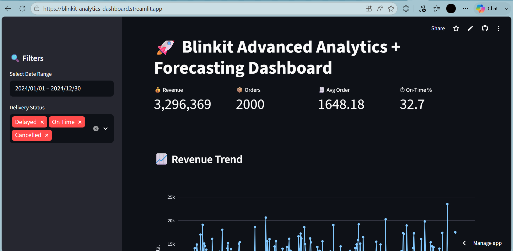

# 🛒 Blinkit Advanced Analytics & Forecasting Dashboard

An interactive data analytics dashboard built using **Python, Pandas, Plotly, and Streamlit** to analyze Blinkit sales data and generate meaningful business insights along with basic forecasting.

---

## 🚀 Live Demo

👉 https://blinkit-analytics-dashboard.streamlit.app

---

## 📸 Dashboard Preview



---

## 📊 Features

* 📈 Revenue and Sales Trend Analysis
* 📦 Order and Outlet Performance Tracking
* ⭐ Rating vs Sales Insights
* 📍 Location-wise Analysis
* 🔍 Interactive Filters (Date, Delivery Status)
* 🤖 Basic Forecasting using Linear Regression

---

## 🛠️ Tech Stack

* Python
* Pandas
* NumPy
* Plotly
* Streamlit
* Scikit-learn

---

## 📁 Project Structure

```
blinkit-analytics-dashboard/
│── blinkit_dashboard.py
│── requirements.txt
│── data/
│── dashboard.png
│── README.md
```

---

## 💡 Key Insights

* Certain outlet categories contribute significantly higher revenue
* Delivery performance impacts overall customer satisfaction
* Ratings show correlation with sales performance
* Revenue trends help in forecasting demand patterns

---

## ⚙️ How to Run Locally

```
git clone https://github.com/mxskaaaan/blinkit-analytics-dashboard.git
cd blinkit-analytics-dashboard
pip install -r requirements.txt
streamlit run blinkit_dashboard.py
```
